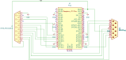

# 9pin2supergun
Code for a Pi Pico to read a CD32 gamepad and output each control to a separate pin for use with Neo Geos and/or Superguns.

I am personally using this code with a [Monster Joysticks CD32 joystick](https://monsterjoysticks.com/deluxe-cd32-retro-joystick-kit-classic) and a [Minigun Supergun](https://www.arcade-projects.com/threads/minigun-supergun-an-open-source-supergun.9408/). I don't know if it works with anything else.

This is in very early days and is *incredibly* basic, but still felt worth publishing to avoid other people having to go to the effort. Aspirationally, this will also read a Mega Drive/Genesis controller, and possibly USB controllers, but the latter is blocked on USB host support in MicroPython and projects to do it already exist. I also intend to create a PCB that uses a bare RP2040 chip to make things a bit neater, but that will wait until I've done the Mega Drive support, since that will add complexity to the circuit due to the different pinouts.

## Requirements

* MicroPython
* A Pi Pico or compatible device that exposes the GPIO pins
* (Optional, but recommended?) a level shifter for shifting the three signal pins going to the CD32 pad
* A DE9 and DA15[^1] connector (ideally plug for DE9, socket for DA15)

## Setup

Wire everything up as per the following (quite bad) diagram:

Add a bidirectional level shifter for 3.3V to 5V between the Pico and pins 5, 6, and 9 of the DE9 to be on the safe side.

Copy over `read_cd32.py` and `main.py` to your Pico (e.g. using `mpremote`) and reboot, and you should now have a Neo Geo/Supergun-compatible output from your CD32 controller. If the buttons are wrong or not to your taste, move them on the DA15 side - each button has a direct mapping to a single pin there.

## Credits

Thanks to [Mathew Carr's PSCD32 Development Diary](https://www.mrdictionary.net/PSCD32/diary/2019_08_09.htm) for documenting how the CD32 protocol actually works.

[^1]: Literally everyone seems to call this a DB15 connector, but it is actually DA15.
